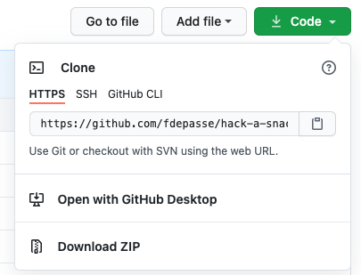

# <p><span>Hack A Snack</span></p>

<br/><br/>

<p align="center"></p>

<br/><br/>

## Table of Contents
* [Overview](#overview)
* [Getting Started](#getting-started)
* [Project Brief](#brief)
* [Technologies Used](#technologies)
* [Team Responsibilities](#team)
* [Approach](#approach)
* [Featured Code](#featured-code)
* [App Walk Through](#app-walk-through)
* [Enhancements](#enhancements)
* [Wins, Challenges & Learnings](#wins-and-challenges)

<br/>

## <a name="overview"></a>Overview
This was the third project from the Software Engineering Immersive Course I took at General Assembly London, built after 8 weeks of class.

It was a **group** project with 4 team members and the timeline was  **9 days**.

The application allows users to browse and search recipes by name or ingredients, filter by dietary requirements, create and share their own recipes as well as commenting others' and saving their favourites to their profile.

It is a full stack app built with React JS, Express, Mongoose and talking to a NoSQL MongoDB database. It has been deployed via Heroku.

>Access the **app** [here](https://hackasnack.herokuapp.com/) and the **repository** [here](https://github.com/fdepasse/hack-a-snack)


<br/>


## <a name="getting-started"></a>Getting Started
Click the "Code" button on the [repository](https://github.com/fdepasse/hack-a-snack) and choose either to **Clone** it or to **Download ZIP** the files.

<p align="center"></p>

You need to install [Node.js](https://nodejs.org/en/) to be able to proceed with the rest of the steps. Once installed and the repository files are on your machine, open 3 tabs in your Command Line Interface (CLI):

* On tab 1, run `mongod --dbpath ~/data/db` to start running MongoDB
* On tab 2, navigate to the root of the project directory and run `npm i` to install the backend dependencies and finally `npm run start` to start running Express
* On tab 3, navigate to the client directory within the project directory and run `npm i` to install the frontend dependencies and finally run `npm run serve` to start running the app in your browser

<br/>

## <a name="brief"></a>Project Brief
* Work in a team, using git to code collaboratively.
* Build a full-stack application by making your own backend and your own front-end
* Use an Express API to serve your data from a Mongo database
* Consume your API with a separate front-end built with React
* Be a complete product which most likely means multiple relationships and CRUD functionality for at least a couple of models
* Implement thoughtful user stories/wireframes that are significant enough to help you know which features are core MVP and which you can cut
* Have a visually impressive design
* Be deployed online so it's publicly accessible
* Have automated tests for at least one RESTful resource on the back-end

<br/>

## <a name="technologies"></a>Technologies Used

|   Frontend   |  Backend |  Testing  |    Development Tools    |            Public APIs            |
|:------------:|:--------:|:---------:|:-----------------------:|:---------------------------------:|
|   React JS   |  Express |    Chai   |         VS Code         | [Edamam](https://www.edamam.com/) |
| React Router | Mongoose |   Mocha   |     Git (branching)     |                                   |
|     Babel    |  MongoDB | Supertest |          GitHub         |                                   |
|    Webpack   |  bcrypt  |           | Google Chrome Dev Tools |                                   |
|     Axios    |    jwt   |           |           Zoom          |                                   |
|    Lodash    |  Webpack |           |          Slack          |                                   |
|     Bulma    |  Node.js |           |      Google Slides      |                                   |
|     Sass     |          |           |          Canva          |                                   |
|    Node.js   |          |           |         Insomnia        |                                   |

<br/>

## <a name="team"></a>Team Responsibilities

|          |                 [Fabien Depasse](https://github.com/fdepasse)                |                [Kate Joyce](https://github.com/kate1562)               |                              [Jess Karia](https://github.com/JessKaria)                              |            [Emily Randall](https://github.com/emilyrandall1998)            |
|:--------:|:----------------------------------------------------------------------------:|:----------------------------------------------------------------------:|:----------------------------------------------------------------------------------------------------:|:--------------------------------------------------------------------------:|
|  Backend |    Recipe reviews <br/> Generating random recipes <br/> Searching recipes    | User authentication <br/> Saving recipes <br/> Getting recipes by user | User registration <br/> User authentication <br/> User profile editing <br/> Recipe creating/editing | Getting all recipes <br/> Getting one recipe <br/> Recipe creating/editing |
| Frontend | Home page <br/> Search functionality <br/> All Recipes page: filtering <br/> |                    User profile page <br/> Carousels                   |                User register/login/logout <br/> Create/Edit a new recipe <br/> Nav Bar               |                      Single Recipe Page <br/> Reviews                      |                       |                     |


<br/>

## <a name="approach"></a>Approach
### Step 1: Planning


#### Problem #1: Deciding on our App Functionalities
We decided we would have two types of users for our app: guests only and registered users. We represented by a flow chart each user experience on our app. We detailed what functionalities they will be able to get, what pages they will be presented with and which backend requests our frontend would need to support our user features. 

<p align="center"><p/>

<br/>

#### Problem #2: Seeding recipe data into our database
In order to get a large enough amount of recipe, we decided to fetch data from the [Edamam](https://www.edamam.com/) API. It offered a large amount of data and the had the fields we needed to support our features. We fetched 500 recipes from the API, using some of most popular food as keywords.

<br/>

#### Problem #3: Planning our Models, Views, Controllers (MVC) and middlewares for our API 
Based on our flow chart and knowing we had the data to support our app, we moved on to designing our Models. At this stage we listed the fields we needed and their data types. We then moved on to decide which end points we would require (views) and what controllers / request type (GET, PUT, POST, DELETE) each of them will handle. Finally we listed the middlewares we would need: a secure route so we could add permission to certain end points (i.e. users can only edit/delete recipe they have created themselves), an error handler and a request logger.

<p align="center"><p/>

<br/>

<hr/>

### Step 2: Building and Testing the Backend
#### Problem #1: Building the Backend
We first worked as a group on the code base we all would need to develop our app features. We started by configuring our Express App including the connection to our MongoDB database, Mongoose and the directory hierarchy for our projects. We then designed our User and Recipe Models together as well as our middlewares. We built our seed file to fetch data from the Edamam API. We finally proceeded with seeding our database which also allowed us to check our models were designed as we expected. At this point we shared the code base between all of us and [split](#team) the responsibilities. Each of us built part of the controllers and made sure to add user permission wherever required by using our `secureRoute` middleware.

<br/>

#### Problem #2: Testing our Backend with integration tests
Once our backend was up and running we all practiced writing integration tests using [Chai](https://www.chaijs.com/), [Mocha](https://mochajs.org/) and [Supertest](https://www.npmjs.com/package/supertest) libraries. We particularly focused on testing the user login and registration but we also tested we were getting our recipe data properly. We set up a test database which gets seeded at the start of each test and dropped at the end of each test. This was to ensure consistency in the data we are testing. Therefore if our tests were passing or failing, we knew it would be because of a genuine bug in our code as oppose to some data that has changed.

```
describe('Testing recipes end points', () => {
  // Seed a fresh database before each test, before and afterEach are from Mocha
  beforeEach(done => {
    setup(done)
  })
  afterEach(done => {
    tearDown(done)
  })

  // Test 1
  it('Should create an array of 5 recipes and return a 200 status', done => {
    api.get('/api/recipes')
      .end((err, res) => {
        expect(res.status).to.eq(200)
        expect(res.body).to.be.an('array')
        expect(res.body.length).to.eq(5)
        done()
      })
  })
})
```
</br>

<hr/>


### Step 3: Building the Frontend
#### Problem #1: Planning the User Interface (UI)
We used Google Slides to wireframe our User Interface as a group. We listed all the pages we would need and what each would look like depending if a user is logged in or not. We also defined how to navigate through the app and planned where the links would sit.


<p align="center">A few examples of our wireframe<p/>

<br/>

#### Problem #2: Building our components in React
Once we understood which pages we will have on our frontend, we broke them down into React components and allocated features to build to each member of the [team](#team). We had regular catch ups as a team to check on each other's progress and troubleshoot blockers as a group.

<br/>

#### Problem #3: Styling our app
As we built components, we all added minimum styling using the CSS framework Bulma. Once all our features were completed we agreed on a styling theme to make sure we have consistency in the final product. Each team member has been assigned a few components to style in line with the agreed scheme. The vast majority of the styling has been done with Bulma and minimal customised CSS.

<br/>

## <a name="featured-code"></a>Featured Code
One of the most interesting challenge I have worked on during this project was to build the search feature both on the backend and on the frontend.

On the backend, I created a view handling a get request for some search data the user would input on the frontend. The search data would be received as query parameters `q` on the backend and using the mongoose method `.find()`, would find recipes matching the search data and return them with a 200 status code.


```
// route
router.route('/search')
  .get(recipes.searchRecipe)
  
// controller
async function searchRecipe(req, res, next) {
  const searchData = req.query.q

  try {
    const recipeList = await Recipes.find({ $text: { $search: `'${searchData}'` } }).populate('user').populate('comments.user')

    res.status(200).send(recipeList)

  } catch (err) {
    console.log(err)
    next(err)
  }
}
```


In order to be able to perform searches on the Recipe model, I slightly modified it and added the below. This tells mongoose to allow search in all fields.

`recipeSchema.index({ '$**': 'text' })`

On the frontend, the search bar has been implemented in different components but let us look at the Home page. When the user enter their search in the input field, an `onChange` event stores it in state `searchData`. The search bar itself is wrapped in a form which takes an `onSubmit` listener and triggers a callback function `handleSubmit`. The callback prevents the browser to reload the page and uses the `history` object `push()` method of react-router to redirect the user to the search results page and store the `searchData` on the `location` object of react-router.

```
  function handleSubmit(event) {
    event.preventDefault()
    try {
      history.push({ pathname: '/search', state: searchData })
    } catch (err) {
      console.log(err)
    }
  }
```

Now react renders the `SearchResults` component and the `searchData` state is updated with the `location.state` we passed from the Home page (this is the user input). We pass `searchData` as query in the URL to make a request to our API in a `useEffect` and store the recipe data returned in state `recipeData`. We then use this data to display and filter the results on the page for the user to see.

```
const SearchResults = ({ location, history }) => {
  const [recipeData, updateRecipeData] = useState([])
  const [searchData, updateSearchData] = useState(location.state)
  const [filterSelected, updateFilterSelected] = useState('All')

  useEffect(() => {
    axios.get('/api/search', { params: { q: searchData } })
      .then(({ data }) => {
        updateRecipeData(data)
      })
  }, [])
```

Should a user do a new search from this page, the same logic applied in the Home component applies here. Even thought the below line in the `handleSubmit()` function pushes to the page the user is already on, it ensures the state is passed to the react-router `location` object. This becomes important if the user click on a recipe to see more details and wish to go back to the results. Without this line, the original state would still be stored on the `location` object and the user will be showed their first search results rather than the most recent.

`history.push({ pathname: '/search', state: searchData }) `

<br/>

## <a name="app-walk-through"></a>App Walk Through

<p align="center"><p/>
<p align="center"><p/>
<p align="center"><p/>
<p align="center"><p/>

## <a name="enhancements"></a>Enhancements
### Remaining bugs
* When a user visit a recipe already saved on their profile, the "Add to saved recipe" toggle is not on
* When reviewing a recipe, the rating cannot be selected before the review is written
* When a user updates their profile, on click of "Update your profile" the pop up doesn't closed and changes only show after the page is refreshed

### Potential Future Enhancements
* The filtering on "All Recipes" does not support multi category filters (i.e. combining "Diet" filters with "Allergens" filters) 
* Break our Frontend into more components and reuse them to avoid code repetition (.i.e. search bar)

<br/>

## <a name="wins-and-challenges"></a>Wins, Challenges & Learnings
### Wins
* Working as a Team has been such a pleasure
* Linking backend and frontend, being able to tailor our backend to serve our frontend needs
* Going further with React and building more complex components
* Building a search and a filtering functionality
* Having a first introduction to automated tests

### Challenges
* Seeding has been challenging, we were limited in the Public API calls to first feed our database
* Manipulate the API data
* Live Share not always easy to use depending on the Internet connection strength

### Learnings
* Planning is absolutely key and has really helped delivering our app on time
* Making sure backend and frontend work well together
* Reading documentations extensively whether it was to use a new library or debug issues
* Working with Git branches, such a great way to collaborate and align with the team
* Deploying on Heroku